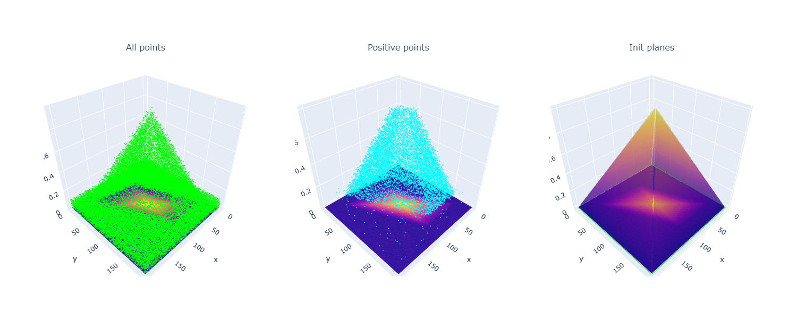
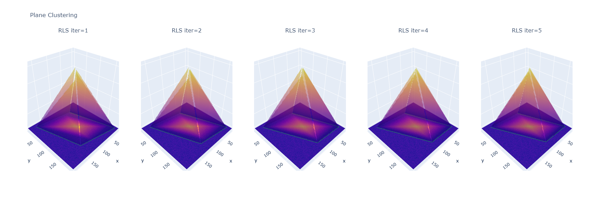
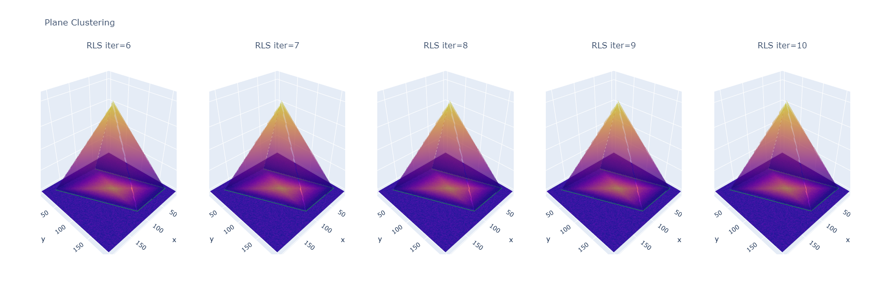

# Visualization for Pyramid Mask and Plane Clustering from Pyramid Mask Text Detector (PMTD)

> | [Paper](https://arxiv.org/abs/1903.11800) | [Code](https://github.com/jjprincess/PMTD) |

```
Pyramid Mask Text Detector;
Liu Jingchao, Liu Xuebo, Sheng Jie, Liang Ding, Li Xin and Liu Qingjie;
arXiv preprint arXiv:1903.11800 (2019).
```

> **Open in Colab to interact with 3D plots.**




